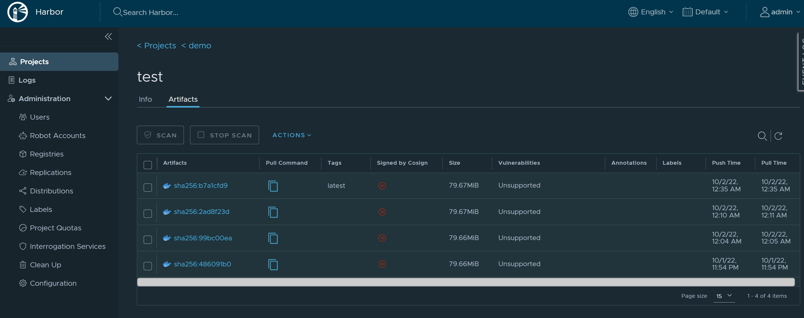

[TOC]


# 01. Installation

## 01.1. Setup K8S Cluster

### Preparation

#### Lab servers

OS image: CentOS 8 stream

K8S Master: 192.168.22.91
K8S Node-1: 192.168.22.92
K8S Node-2: 192.168.22.93

Rancher: 192.168.22.84 admin/novirus

GitLab: 192.168.22.85. root/P@ssw0rd

Harbor: 192.168.22.86 admin/novirus

Jenkins on Kubernetes: 192.168.22.61:32001

Jenkins on CentOS8: 192.168.22.87:8080 

Grafana:  192.168.22.61:32000


#### Initial environment setup for master and node servers

Environment_ini.sh

```bash
# Disable SELinux
setenforce 0
sed -i 's/^SELINUX=enforcing$/SELINUX=disabled/' /etc/selinux/config

# Disable firewall permanently
systemctl disable firewalld --now
systemctl mask --now firewalld
#systemctl status firewalld

# Diable swap temporally
swapoff -a

#永久禁掉swap分区，注释掉swap那一行
sed -ri 's/.*swap.*/#&/' /etc/fstab

# Adjust kernel parameters
cat <<EOF > /etc/sysctl.d/k8s.conf
net.bridge.bridge-nf-call-ip6tables = 1
net.bridge.bridge-nf-call-iptables = 1
EOF
sysctl --system

# Load netfilter kernel module
modprobe br_netfilter
lsmod | grep br_netfilter

# Network gateway and proxy settings, only GW=192.168.0.250 can reach TW proxy=10.64.1.81:8080
route -n | grep -i ug

# sync time with chronyd
sudo systemctl start chronyd
sudo systemctl enable chronyd
chronyc activity
chronyc tracking
```

#### Set proxy for Lab environment

Proxy_set.sh

```bash
# Set proxy for os system
export HTTPS_PROXY="10.64.1.81:8080"
export HTTP_PROXY="10.64.1.81:8080"
export NO_PROXY="10.64.0.0/16,172.168.1.0/24,127.0.0.0/8,10.0.0.0/8,192.168.0.0/16"
```

#### Install Docker for master and node servers

Docker_install.sh

```bash
# Install required packages. yum-utils provides the yum-config-manager utility, and device-mapper-persistent-data and lvm2 are required by the devicemapper storage driver.
yum install -y yum-utils device-mapper-persistent-data lvm2

# Use the following command to set up the stable repository
yum-config-manager --add-repo https://download.docker.com/linux/centos/docker-ce.repo

# Remove podman buildah to avoid the error: "Error: Problem 1: problem with installed package podman-1:3.4.1-3.module_el8.6.0+954+963caf36.x86_64 - package podman-1:3.4.1-3.module_el8.6.0+954+963caf36.x86_64 requires runc >= 1.0.0-57, but none of the providers can be installed"
yum erase -y podman buildah

# Install docker
yum install -y docker-ce docker-ce-cli containerd.io

# If need to install a specific version, can use below commands
## yum list docker-ce --showduplicates | sort -r
## sudo yum install docker-ce-<VERSION_STRING> docker-ce-cli-<VERSION_STRING> containerd.io
## for example: 3:19.03.2-3.el7
## yum install docker-ce-<3:19.03.2-3.el7> docker-ce-cli-<3:19.03.2-3.el7> containerd.io
# Start and Enable Docker
systemctl start docker &&  systemctl enable docker


# Set proxy for docker 
mkdir /etc/systemd/system/docker.service.d
cat << EOF > /etc/systemd/system/docker.service.d/http-proxy.conf
[Service]
Environment="HTTP_PROXY=10.64.1.81:8080"
Environment="HTTPS_PROXY=10.64.1.81:8080"
Environment="NO_PROXY=localhost,127.0.0.0/8,10.0.0.0/8,192.168.0.0/16,docker-registry.somecorporation.com"
EOF

# Reload and restart docker
systemctl daemon-reload && systemctl restart docker

# Show docker proxy settings
systemctl show --property Environment docker
```

### Install Kubernetes

#### [Installing kubeadm, kubelet and kubectl](https://kubernetes.io/docs/setup/production-environment/tools/kubeadm/install-kubeadm/#installing-kubeadm-kubelet-and-kubectl) on Master and node servers

K8s_install.sh

```bash
# Install kubeadm, kubelet and kubectl with Aliyun repo
cat <<EOF > /etc/yum.repos.d/kubernetes.repo
[kubernetes]
name=Kubernetes
baseurl=https://mirrors.aliyun.com/kubernetes/yum/repos/kubernetes-el7-x86_64/
enabled=1
gpgcheck=0
repo_gpgcheck=0
gpgkey=https://mirrors.aliyun.com/kubernetes/yum/doc/yum-key.gpg https://mirrors.aliyun.com/kubernetes/yum/doc/rpm-package-key.gpg
EOF

# Set SELinux in permissive mode (effectively disabling it)
sudo setenforce 0
sudo sed -i 's/^SELINUX=enforcing$/SELINUX=permissive/' /etc/selinux/config


# sudo yum install -y kubelet kubeadm kubectl --disableexcludes=kubernetes
# install version 1.23.5 which is stable version. Installing lastest version usually have unknown issue when initialization
sudo yum -y install kubeadm-1.23.5 kubelet-1.23.5 kubectl-1.23.5


# !!! before enable kubelet, need to ensure docker and kubelet driver are the same, otherwise, there's below error message after "kubeadm init" command: "cgroup and systemd are not matched"
# [error: failed to run Kubelet: failed to create kubelet: misconfiguration: kubelet cgroup driver: “systemd” is different from docker cgroup driver: “cgroupfs”]

cat <<EOF > /usr/lib/systemd/system/kubelet.service.d/10-kubeadm.conf
# Note: This dropin only works with kubeadm and kubelet v1.11+
[Service]
Environment="KUBELET_KUBECONFIG_ARGS=--bootstrap-kubeconfig=/etc/kubernetes/bootstrap-kubelet.conf --kubeconfig=/etc/kubernetes/kubelet.conf"
Environment="KUBELET_CONFIG_ARGS=--config=/var/lib/kubelet/config.yaml"
Environment="KUBELET_CGROUP_ARGS=--cgroup-driver=cgroupfs"
# This is a file that "kubeadm init" and "kubeadm join" generates at runtime, populating the KUBELET_KUBEADM_ARGS variable dynamically
EnvironmentFile=-/var/lib/kubelet/kubeadm-flags.env
# This is a file that the user can use for overrides of the kubelet args as a last resort. Preferably, the user should use
# the .NodeRegistration.KubeletExtraArgs object in the configuration files instead. KUBELET_EXTRA_ARGS should be sourced from this file.
EnvironmentFile=-/etc/sysconfig/kubelet
ExecStart=
ExecStart=/usr/bin/kubelet \$KUBELET_KUBECONFIG_ARGS \$KUBELET_CONFIG_ARGS \$KUBELET_KUBEADM_ARGS \$KUBELET_EXTRA_ARGS \$KUBELET_CGROUP_ARGS
EOF

###################
# !!! before enable kubelet, need to ensure docker and kubelet driver are the same, otherwise, there's below error message after "kubeadm init" command: "cgroup and systemd are not matched"
# [error: failed to run Kubelet: failed to create kubelet: misconfiguration: kubelet cgroup driver: “systemd” is different from docker cgroup driver: “cgroupfs”]

# vi  /usr/lib/systemd/system/kubelet.service.d/10-kubeadm.conf


#Update below parameter:
#Environment="KUBELET_CGROUP_ARGS=--cgroup-driver=cgroupfs"
#ExecStart=/usr/bin/kubelet $KUBELET_KUBECONFIG_ARGS $KUBELET_CONFIG_ARGS $KUBELET_KUBEADM_ARGS $KUBELET_EXTRA_ARGS $KUBELET_CGROUP_ARGS
#######################

systemctl daemon-reload && systemctl restart kubelet
sudo systemctl enable --now kubelet
```

#### Init Kubenetes with network and configure kubectl as regular user on Master server

Network_kubectl_user.sh

```bash
# restart container CRI
rm -rf /etc/containerd/config.toml
systemctl restart containerd

kubeadm init --pod-network-cidr=10.100.0.0/16
#参考：如果要指定Kubernetes的版本,可以用一下命令
#kubeadm init --kubernetes-version=v1.15.1 --pod-network-cidr=10.100.0.0/16

# 如果初始化失败，记得执行清空
# kubeadm reset

# 卸载管理组件
# yum erase -y kubelet kubectl kubeadm kubernetes-cni


mkdir -p $HOME/.kube
sudo cp -i /etc/kubernetes/admin.conf $HOME/.kube/config
sudo chown $(id -u):$(id -g) $HOME/.kube/config
```

#### Install network plugin and weave tool on Master server

Network_plugin.sh

```bash
# Install network plugin weave
kubectl apply -f "https://cloud.weave.works/k8s/net?k8s-version=$(kubectl version | base64 | tr -d '\n')"

sudo curl --proxy 10.64.1.81:8080 -L git.io/weave -o /usr/local/bin/weave
sudo chmod a+x /usr/local/bin/weave
weave ps
weave status
weave status peers
weave status connections
```


### Post-Installation

#### Join node server to master

Node_join.sh

```bash
# avoid error: [ERROR FileContent–proc-sys-net-ipv4-ip_forward]: /proc/sys/net/ipv4/ip_forward contents are not set to 1
echo 1 > /proc/sys/net/ipv4/ip_forward

# Below command is copied from the output of the "kubeadm init"
kubeadm join 192.168.22.81:6443 --token d0cbz5.9nugb974yhl54ss6 \
	--discovery-token-ca-cert-hash sha256:bc7099ce8ff86c2cc7d8d51b0f30c4d57cbd3fbe967e81f8f05c2decf9599b07 

# Check K8S cluster nodes and pods status
kubectl get nodes
kubectl get pods --all-namespaces -o wide
```

#### Install helm3 on K8SMaster

Helm3_install.sh

```bash
wget -e "https_proxy=10.64.1.81:8080"  https://get.helm.sh/helm-v3.1.2-linux-amd64.tar.gz
tar -zxvf helm-v3.1.2-linux-amd64.tar.gz
cd linux-amd64/
mv helm /usr/bin/
helm version


# helm init is not used any more since helm3
# $ kubectl create serviceaccount --namespace kube-system tiller
# $ kubectl create clusterrolebinding tiller-cluster-role --clusterrole=cluster-admin --serviceaccount=kube-system:tiller
# $ helm init --upgrade -i registry.cn-hangzhou.aliyuncs.com/google_containers/tiller:v2.15.1 --service-account=tiller --stable-repo-url https://kubernetes.oss-cn-hangzhou.aliyuncs.com/charts
# add helm repo
helm repo add  aliyuncs https://apphub.aliyuncs.com
helm repo list
helm search repo aliyuncs | head -5
```

#### something more about helm

```bash
# add helm repo
[root@CentOS001 ~]# helm repo add stable http://mirror.azure.cn/kubernetes/charts
"stable" has been added to your repositories
[root@CentOS001 ~]# helm repo add aliyun  https://kubernetes.oss-cn-hangzhou.aliyuncs.com/charts
"aliyun" has been added to your repositories
[root@CentOS001 ~]# helm repo add jetstack https://charts.jetstack.io
"jetstack" has been added to your repositories

# update helm repo
[root@CentOS001 ~]# helm repo update
Hang tight while we grab the latest from your chart repositories...
...Successfully got an update from the "jetstack" chart repository
...Successfully got an update from the "aliyun" chart repository
...Successfully got an update from the "stable" chart repository
Update Complete. ⎈ Happy Helming!⎈ 

# list helm repo
[root@CentOS001 ~]# helm repo list
NAME    	URL                                                   
stable  	http://mirror.azure.cn/kubernetes/charts              
aliyun  	https://kubernetes.oss-cn-hangzhou.aliyuncs.com/charts
jetstack	https://charts.jetstack.io                            

# search chart
[root@CentOS001 ~]# helm search repo nginx
NAME                       	CHART VERSION	APP VERSION	DESCRIPTION                                       
aliyun/nginx-ingress       	0.9.5        	0.10.2     	An nginx Ingress controller that uses ConfigMap...
aliyun/nginx-lego          	0.3.1        	           	Chart for nginx-ingress-controller and kube-lego  
stable/nginx-ingress       	1.41.3       	v0.34.1    	DEPRECATED! An nginx Ingress controller that us...
stable/nginx-ldapauth-proxy	0.1.6        	1.13.5     	DEPRECATED - nginx proxy with ldapauth            
stable/nginx-lego          	0.3.1        	           	Chart for nginx-ingress-controller and kube-lego  
aliyun/gcloud-endpoints    	0.1.0        	           	Develop, deploy, protect and monitor your APIs ...
stable/gcloud-endpoints    	0.1.2        	1          	DEPRECATED Develop, deploy, protect and monitor..
```


### Common Troubleshooting Tips

```bash
kubectl get nodes
kubectl get ds -n kube-system
kubectl get pod
kubectl get pods -n kube-system
kubectl get pods -n kube-system -o wide
kubectl logs weave-net-ldsgl  -n kube-system weave-npc
kubectl describe pod auth-54d7667c5d-sgrt8
systemctl status kubelet
journalctl -f -u kubelet
# If the init container failed, subsequent container initilization just pending there, no logs from below commands
kubectl logs auth-54d7667c5d-dnslv
kubectl logs scan-687c4bfddd-w5fbk  --previous
# check why init container failed, lead to subsequent container can not be initialized
kubectl logs scan-687c4bfddd-w5fbk  -c db-init 
```


## 01.2. Setup Rancher

### prerequisites

refer to [rancher support matrix](https://www.suse.com/assets/v2.5.16-Support-Matrix.pdf)

| Rancher Server | OS        | Docker   | K8S      |
| -------------- | --------- | -------- | -------- |
| v2.4.9         | CentOS8.2 | 20.10.18 | v1.18.20 |


### Install rancher on docker 

```
sudo docker run -d --restart=unless-stopped --privileged  -p 80:80 -p 443:443 rancher/rancher:v2.4.9
```


### Import existing K8S cluster on rancher console


#### Run commands on K8S master

```bash
kubectl create serviceaccount felix
kubectl create clusterrolebinding cluster-admin-binding --clusterrole cluster-admin --user=felix

curl --insecure -sfL https://192.168.22.84/v3/import/5glwxx7gnhkc4zldnb8ts5xnrxv244cwmz5qrgw4k6jfkvf577t7b9.yaml | kubectl apply -f -
kubectl get pods --all-namespaces -o wide
```


## 01.3. Setup Gitlab

### Prerequisites

https://packages.gitlab.com/gitlab/gitlab-ce/packages/el/8/gitlab-ce-14.2.3-ce.0.el8.x86_64.rpm

### Install gitlab

```bath
sudo yum install -y curl policycoreutils-python policycoreutils-python-utils policycoreutils openssh-server openssh-clients perl
sudo systemctl enable sshd
sudo systemctl start sshd

dnf install postfix
systemctl enable postfix
systemctl start postfix

curl -s https://packages.gitlab.com/install/repositories/gitlab/gitlab-ce/script.rpm.sh | sudo bash
sudo EXTERNAL_URL="http://192.168.22.85"  yum install gitlab-ce-14.2.3-ce.0.el8.x86_64
```


***Output:*** 

```bash
Default admin account has been configured with following details:
Username: root
Password: You didn't opt-in to print initial root password to STDOUT.
Password stored to /etc/gitlab/initial_root_password. This file will be cleaned up in first reconfigure run after 24 hours.

NOTE: Because these credentials might be present in your log files in plain text, it is highly recommended to reset the password following https://docs.gitlab.com/ee/security/reset_user_password.html#reset-your-root-password.

gitlab Reconfigured!

       *.                  *.
      ***                 ***
     *****               *****
    .******             *******
    ********            ********
   ,,,,,,,,,***********,,,,,,,,,
  ,,,,,,,,,,,*********,,,,,,,,,,,
  .,,,,,,,,,,,*******,,,,,,,,,,,,
      ,,,,,,,,,*****,,,,,,,,,.
         ,,,,,,,****,,,,,,
            .,,,***,,,,
                ,*,.
  


     _______ __  __          __
    / ____(_) /_/ /   ____ _/ /_
   / / __/ / __/ /   / __ `/ __ \
  / /_/ / / /_/ /___/ /_/ / /_/ /
  \____/_/\__/_____/\__,_/_.___/
  

Thank you for installing GitLab!
GitLab should be available at http://192.168.22.85

For a comprehensive list of configuration options please see the Omnibus GitLab readme
https://gitlab.com/gitlab-org/omnibus-gitlab/blob/master/README.md

Help us improve the installation experience, let us know how we did with a 1 minute survey:
https://gitlab.fra1.qualtrics.com/jfe/form/SV_6kVqZANThUQ1bZb?installation=omnibus&release=14-2


  Verifying        : gitlab-ce-14.2.3-ce.0.el8.x86_64                                                                                                                                                           1/1 

Installed:
  gitlab-ce-14.2.3-ce.0.el8.x86_64                                                                                                                                                                                  

Complete!
```


```
root
Password: x35fWPKFju3JP7QLQ+VXgFYwKvQtwh77sCl8Jjw+8xQ=
```


### Useful commands

```bash
vim  /etc/gitlab/gitlab.rb
external_url 'http://192.168.22.85'

重置并启动GitLab:
gitlab-ctl reconfigure
gitlab-ctl restart  

查看服务状态：
gitlab-ctl status

开启服务： 
gitlab-ctl start

关闭服务：
gitlab-ctl stop 

关闭gitlab的自动启动
systemctl disable gitlab-runsvdir.service

开启gitlab的自动启动：
systemctl enable gitlab-runsvdir.service
systemctl start gitlab-runsvdir.service
gitlab-cmd start

```


## 01.4. Setup Jenkins

### Option-1: Set up a Jenkins server on Kubernetes

[How To Setup Jenkins On Kubernetes Cluster – Beginners Guide](https://devopscube.com/setup-jenkins-on-kubernetes-cluster/)

Access Jenkins:

http://192.168.22.61:32001/login?from=%2F

Get the initial password of Jenkins

```bash
[root@k8smaster ~]# kubectl get pods -n devops-tools
NAME                      READY   STATUS    RESTARTS   AGE
jenkins-b96f7764f-g5fhh   1/1     Running   0          11m

[root@k8smaster ~]# kubectl exec jenkins-b96f7764f-g5fhh -n devops-tools -it bash
kubectl exec [POD] [COMMAND] is DEPRECATED and will be removed in a future version. Use kubectl exec [POD] -- [COMMAND] instead.

jenkins@jenkins-b96f7764f-g5fhh:/$ cat /var/jenkins_home/secrets/initialAdminPassword
04a4a6c9e79c4428930a92f433427dce
```

#### Errors and resolution

```
"An error occurred during installation: No such plugin: cloudbees-folder"
```

Resolution is to restart Jenkins: http://localhost:8080/restart

### Option-2: Set up a Jenkins server on CentOS8

Reference:

https://sysadminxpert.com/install-openjdk-11-on-centos-7/

https://www.jianshu.com/p/85ab4db26857

<!--Need to install Java 11-->

- Install OpenJDK 11

  ```bash
   yum -y install java-11-openjdk java-11-openjdk-devel
   echo "export JAVA_HOME=$(dirname $(dirname $(readlink $(readlink $(which javac)))))" >> ~/.bash_profile
   cat ~/.bash_profile
  
  java –version
  
  echo $JAVA_HOME
  ```

  

- Set or configure default Java version if there's another/old version already installed

  ```bash
  alternatives --config javac
  
  # Set JAVA_HOME Environment Variable
  vim ~/.bash_profile
  
  JAVA_HOME="/usr/lib/jvm/java-11-openjdk-11.0.7.10-4.el7_8.x86_64/bin/java"
  
  source ~/.bash_profile
  echo $JAVA_HOME
  ```

  

- Test Java installation

  ```bash
  cat > hello_world.java <<EOF
  public class helloworld {
    public static void main(String[] args) {
      System.out.println("Hello Java World!");
    }
  }
  EOF
  
  java hello_world.java
  ```

  

- Add the Jenkins Repository and Verify security key

  ```bash
  sudo wget -O /etc/yum.repos.d/jenkins.repo http://pkg.jenkins-ci.org/redhat-stable/jenkins.repo
  sudo rpm --import https://jenkins-ci.org/redhat/jenkins-ci.org.key
  
  ```

- Update packages

  ```bash
  yum update
  ```

- Install Jenkins

  ```bash
  yum install jenkins -y
  ```

- Configure and start Jenkins service 

  ```bash
  systemctl daemon-reload
  systemctl start jenkins
  ```

- Get initial password

  ```bash
  cat /var/lib/jenkins/secrets/initialAdminPassword
  ```

  

## 01.5. Setup Harbor

### Prerequisites

#### Install docker

#### Install docker compose

```bash
sudo yum install docker-compose-plugin
sudo chmod +x /usr/libexec/docker/cli-plugins/docker-compose
ln -s /usr/libexec/docker/cli-plugins/docker-compose /usr/sbin/docker-compose
docker-compose version
```

#### Download harbor offline package:

https://github.com/goharbor/harbor/releases/tag/v2.6.0

#### Install harbor

```bash
tar -zxvf harbor-online-installer-v2.6.0.tgz -C /usr/local/
cd /usr/local/harbor/
cp harbor.yml.tmpl harbor.yml
```

Modify harbor.yml to disable https and add IP address in hostname

```bash

++++++++++++++
hostname: 192.168.22.86

# http related config
http:
  # port for http, default is 80. If https enabled, this port will redirect to https port
  port: 80

# https related config
#https:
  # https port for harbor, default is 443
  #port: 443
  # The path of cert and key files for nginx
  #certificate: /your/certificate/path
  #private_key: /your/private/key/path
+++++++++++++++
```

Install harbor

```
./prepare
./install.sh 
```


### Access the harbor console




## 01.6. Setup InfluxDB on Kubernetes

### Step by step

Reference articles:

https://www.cnblogs.com/zhangsi-lzq/p/14457707.html

https://opensource.com/article/19/2/deploy-influxdb-grafana-kubernetes

- Create namespace: influxdb

  ```
  kubectl create namespace influxdb
  ```

- create a secret using the **kubectl create secret** command and some basic credentials

  ```
  kubectl create secret generic influxdb-creds -n influxdb \
    --from-literal=INFLUXDB_DATABASE=twittergraph \
    --from-literal=INFLUXDB_USERNAME=root \
    --from-literal=INFLUXDB_PASSWORD=root \
    --from-literal=INFLUXDB_HOST=influxdb
    
  kubectl get secret influxdb-creds -n influxdb
  kubectl describe secret influxdb-creds -n influxdb
  ```

  

- create and configure persistent storage for InfluxDB

  - Setup the nfs server: 192.168.22.60

    ```
    # 在nfs上安装nfs服务
    [root@nfs ~]# yum install nfs-utils -y
    
    # 准备一个共享目录
    [root@nfs ~]# mkdir /root/data/influxdbpv -pv
    
    # 将共享目录以读写权限暴露给192.168.5.0/24网段中的所有主机
    [root@nfs ~]# vim /etc/exports
    [root@nfs ~]# more /etc/exports
    /root/data/influxdbpv     192.168.22.0/24(rw,no_root_squash)
    
    # 启动nfs服务
    [root@nfs ~]# systemctl restart nfs-server
    
    # 在每个node上安装nfs服务，注意不需要启动
    [~]# yum install nfs-utils -y
    ```

  - create pv and pvc

    ```yaml
    apiVersion: v1
    kind: PersistentVolume
    metadata:
      name:  influxdbpv
    spec:
      capacity: 
        storage: 10Gi
      accessModes:
      - ReadWriteMany
      persistentVolumeReclaimPolicy: Retain
      nfs:
        path: /root/data/influxdbpv
        server: 192.168.22.60
    ---
    apiVersion: v1
    kind: PersistentVolumeClaim
    metadata:
      name: influxdb
      namespace: influxdb
    spec:
      accessModes:
      - ReadWriteMany
      resources:
        requests:
          storage: 8Gi
    ```

    

- create configmap from default conf file

  ```bash
  docker pull influxdb:1.6.4
  
  # --rm means to remove the container after the command run
  docker run --rm influxdb:1.6.4 influxd config > influxdb.conf
  
  
  kubectl create configmap influxdb-config --from-file influxdb.conf -n influxdb
  kubectl get cm influxdb-config -n influxdb
  ```

- create deployment yaml

  `kubectl get deploy influxdb -n influxdb -o yaml > influxdb_deploy.yaml`

  ```yaml
  apiVersion: apps/v1
  kind: Deployment
  metadata:
    annotations:
      deployment.kubernetes.io/revision: "4"
    labels:
      app: influxdb
    name: influxdb
    namespace: influxdb
  spec:
    replicas: 1
    selector:
      matchLabels:
        app: influxdb
    template:
      metadata:
        labels:
          app: influxdb
      spec:
        containers:
        - envFrom:
          - secretRef:
              name: influxdb-creds
          image: docker.io/influxdb:1.6.4
          imagePullPolicy: IfNotPresent
          name: influxdb
          terminationMessagePath: /dev/termination-log
          terminationMessagePolicy: File
          volumeMounts:
          - mountPath: /var/lib/influxdb
            name: var-lib-influxdb
          - mountPath: /etc/influxdb
            name: influxdb-config
        dnsPolicy: ClusterFirst
        restartPolicy: Always
        schedulerName: default-scheduler
        securityContext: {}
        terminationGracePeriodSeconds: 30
        volumes:
        - name: var-lib-influxdb
          persistentVolumeClaim:
            claimName: influxdb
        - configMap:
            defaultMode: 420
            name: influxdb-config
          name: influxdb-config
  ```

- expose service for external access

  ```yaml
  apiVersion: v1
  kind: Service
  metadata:
    name: influxdb-svc
    namespace: influxdb
  spec:
    type: NodePort
    ports:
      - port: 8086
        targetPort: 8086
        nodePort: 32002
        name: influxdb
    selector:
      app: influxdb
  ```

- check status

  ```
  [root@k8smaster influxdb]# kubectl get pods,deployment,rs,svc,ep -n influxdb -o wide
  NAME                            READY   STATUS    RESTARTS   AGE     IP          NODE       NOMINATED NODE   READINESS GATES
  pod/influxdb-5c576d94b4-r8ln8   1/1     Running   0          3h26m   10.42.0.5   k8s-n301   <none>           <none>
  
  NAME                       READY   UP-TO-DATE   AVAILABLE   AGE     CONTAINERS   IMAGES                     SELECTOR
  deployment.apps/influxdb   1/1     1            1           5h55m   influxdb     docker.io/influxdb:1.6.4   app=influxdb
  
  NAME                                  DESIRED   CURRENT   READY   AGE     CONTAINERS   IMAGES                     SELECTOR
  replicaset.apps/influxdb-5c576d94b4   1         1         1       4h2m    influxdb     docker.io/influxdb:1.6.4   app=influxdb,pod-template-hash=5c576d94b4
  replicaset.apps/influxdb-6564f56995   0         0         0       4h40m   influxdb     docker.io/influxdb:1.6.4   app=influxdb,pod-template-hash=6564f56995
  replicaset.apps/influxdb-88c898c6f    0         0         0       4h30m   influxdb     docker.io/influxdb:1.6.4   app=influxdb,pod-template-hash=88c898c6f
  replicaset.apps/influxdb-c4df979df    0         0         0       4h37m   influxdb     docker.io/influxdb:1.6.4   app=influxdb,pod-template-hash=c4df979df
  
  NAME                   TYPE       CLUSTER-IP      EXTERNAL-IP   PORT(S)          AGE     SELECTOR
  service/influxdb-svc   NodePort   10.106.242.32   <none>        8086:32002/TCP   3h32m   app=influxdb
  
  NAME                     ENDPOINTS        AGE
  endpoints/influxdb-svc   10.42.0.5:8086   3h32m
  ```

### Enable authentication for InfluxDB

- Create db user

  ```
  kubectl -n influxdb exec influxdb-dp-6c8756cfcd-pc8gf -it -- /bin/bash
  bash-5.0# influx
  Connected to http://localhost:8086 version 1.6.4
  InfluxDB shell version: 1.6.4
  > CREATE USER root WITH PASSWORD '123456' WITH ALL PRIVILEGES
  > show users
  user admin
  ---- -----
  root true
  > exit
  ```

- modify configmap, to enable authentication

  ```
  kubectl edit cm influxdb-config  -n influxdb
  #....skip....
      [http]
        enabled = true
        bind-address = ":8086"
        auth-enabled = true        #change from false to true
  #....skip....
  ```

- Restart pod to reload configmap file

  ```
  kubectl -n influxdb delete pod influxdb-dp-6c8756cfcd-pc8gf
  kubectl -n influxdb get pod
  NAME                           READY   STATUS    RESTARTS   AGE
  influxdb-dp-6c8756cfcd-fhvws   1/1     Running   0          30s
  ```

- Test authentication

  ```
  kubectl -n influxdb exec influxdb-dp-6c8756cfcd-fhvws -it -- /bin/bash
  bash-5.0# influx
  Connected to http://localhost:8086 version 1.6.4
  InfluxDB shell version: 1.6.4
  > show database;
  ERR: unable to parse authentication credentials
  Warning: It is possible this error is due to not setting a database.        
  Please set a database with the command "use <database>".
  > auth                                                                      
  username: root
  password: 
  > show databases                                                            
  name: databases
  name
  ----
  _internal
  > exit
  ```

  

### Useful commands

```bash
# Run a influxdb instand directly with deployment
kubectl create deployment influxdb --image=docker.io/influxdb:1.6.4 -n influxdb

# edit the resource on-line
kubectl edit deployment influxdb -n influxdb

# Test influxdb connection, data writing and reading
----
#!/bin/bash
while true
do
processes=$(cat /proc/stat | awk '/processes/{print $2}')
curl -i -XPOST 'http://192.168.22.61:32002/write?db=test' --data-binary "performance,type=processes value=$processes"
sleep 60
done
----

[root@nfs ~]# ./test.sh 
HTTP/1.1 204 No Content
Content-Type: application/json
Request-Id: 493a3dd6-3fdd-11ed-8007-000000000000
X-Influxdb-Build: OSS
X-Influxdb-Version: 1.6.4
X-Request-Id: 493a3dd6-3fdd-11ed-8007-000000000000
Date: Thu, 29 Sep 2022 09:58:36 GMT

HTTP/1.1 204 No Content
Content-Type: application/json
Request-Id: 6d125a7f-3fdd-11ed-8008-000000000000
X-Influxdb-Build: OSS
X-Influxdb-Version: 1.6.4
X-Request-Id: 6d125a7f-3fdd-11ed-8008-000000000000
Date: Thu, 29 Sep 2022 09:59:36 GMT


[root@nfs ~]# curl -G 'http://192.168.22.61:32002/query?pretty=true' --data-urlencode "db=test" --data-urlencode "q=select * from performance order by time desc"
{
    "results": [
        {
            "statement_id": 0,
            "series": [
                {
                    "name": "performance",
                    "columns": [
                        "time",
                        "type",
                        "value"
                    ],
                    "values": [
                        [
                            "2022-09-29T09:59:36.859605683Z",
                            "processes",
                            7109601
                        ],
                        [
                            "2022-09-29T09:58:36.723087558Z",
                            "processes",
                            7109596
                        ]
                    ]
                }
            ]
        }
    ]
}
```


# 02. CICD configuration

## 02.1. Configure Gitlab

- Add new group : *MyApp*

- Add user: *felix*

- Assign user to the group

- Add a project : *test*

- Add ssh key for gitlab connection

  - At rancher server, create the ssh key

    ```bash
    [root@CentOS004 ~]# ssh-keygen -t rsa -b 2048 -C "felix@demo.com"
    Generating public/private rsa key pair.
    Enter file in which to save the key (/root/.ssh/id_rsa): 
    Created directory '/root/.ssh'.
    Enter passphrase (empty for no passphrase): 
    Enter same passphrase again: 
    Your identification has been saved in /root/.ssh/id_rsa.
    Your public key has been saved in /root/.ssh/id_rsa.pub.
    The key fingerprint is:
    SHA256:QFuC63n5VJBGTlKbG7oCzjXfnoR+azYAZKi490C918Q felix@demo.com
    The key's randomart image is:
    +---[RSA 2048]----+
    |   . .+o=.       |
    |  . +. B+o       |
    |.. + .oo=.       |
    |o . +  oEo.      |
    | o..o+.+S.       |
    |.ooo+o=+o        |
    | .oo.o++o        |
    |    .o o*.       |
    |      .++o       |
    +----[SHA256]-----+
    [root@CentOS004 ~]# cd ~/.ssh/
    [root@CentOS004 .ssh]# ll
    total 8
    -rw-------. 1 root root 1823 Sep 29 09:41 id_rsa
    -rw-r--r--. 1 root root  396 Sep 29 09:41 id_rsa.pub
    [root@CentOS004 .ssh]# cat id_rsa.pub 
    ssh-rsa AAAAB3NzaC1yc2EAAAADAQABAAABAQCnB34PpjflNQhmHq3ZxJqRb6veoMRJe49ZQWNEqWFAnndDYlHPUw/q+6z14Ef2YWMLZqvNzLRPCYALTmsJNe05Ln/q/iQ2AM0wDrAUz8FegTPwTrTn9w7L+JezRDQh0Q46tPP8snJdUE+NjEqFNwUT+0ug42+LG9BaLho9HViPBeAQDI2UKNb33lg/y09JxsHqXqqviM+Bjo3G79DsP4p+przNGztReln8+fu6rax3czGfnIs6FvIH6GN8pRny3pVfM89sPxtyF3JqkhJGVgrbwN4v8zRUUI/bXJgKYBWpROt3K2GXf9aY2YSS1xsvvs1rl00xdmYL44YnrAMuv8Xd felix@demo.com
    
    ```

  - Copy id_rsa.pub text into **public SSH key** field

    

  - Test connection and git pull from rancher server

    ```bash
    [root@CentOS004 .ssh]# ssh -T -p 22 git@192.168.22.85
    The authenticity of host '192.168.22.85 (192.168.22.85)' can't be established.
    ECDSA key fingerprint is SHA256:/QoEvOYhu/IIbXkiLmBAeTtIyEceztIMRGr8//HfcH0.
    Are you sure you want to continue connecting (yes/no/[fingerprint])? yes
    Warning: Permanently added '192.168.22.85' (ECDSA) to the list of known hosts.
    Welcome to GitLab, @root!
    
    
    [root@CentOS004 ~]# git clone http://192.168.22.85/myapp/test.git
    Cloning into 'test'...
    remote: Enumerating objects: 3, done.
    remote: Counting objects: 100% (3/3), done.
    remote: Total 3 (delta 0), reused 0 (delta 0), pack-reused 0
    Receiving objects: 100% (3/3), done.
    [root@CentOS004 ~]# cd test
    [root@CentOS004 test]# ll
    total 4
    -rw-r--r--. 1 root root 8 Sep 29 09:56 README.md
    ```


## 02.2. Configure Harbor

- Create project
  - project name: *demo*
  - Access level: *public*
- Create user
  - Name: *felix*
- Assign user into the project
  - Role: *project admin*


## 02.3. Configure Jenkins

- Create account
  - Name: *felix*

- Create jenkins credential with kind: *SSH Username with private key*
  - ID: demo

  - Username: git

  - Private Key:  <pasted from rancher server: ~/.ssh/id_rsa>

  - Create a new Jenkins task: *myapp *with freestyle project
    - configure source code management with git

    - Repository URL: ssh://git@192.168.22.85/myapp/test.git

    - If there's error "[Jenkins Host key verification failed](https://stackoverflow.com/questions/15174194/jenkins-host-key-verification-failed)" , [refer to this solution](https://stackoverflow.com/questions/15174194/jenkins-host-key-verification-failed).

      ```bash
      sudo su -s /bin/bash jenkins
      git ls-remote -h -- ssh://git@192.168.22.85/myapp/test.git HEAD
      
      cat ~/.ssh/known_hosts
      ```

  - Branches to build:  */main

- Install cloudbase plug-in
  - [CloudBees Docker Build and Publish pluginVersion1.4.0](https://plugins.jenkins.io/docker-build-publish)

- Add user: *Jenkins* into group: *docker*, to ensure read priviledge of docker/unix socket

  ```bash
  usermod -a -G docker jenkins
  systemctl restart jenkins
  newgrp docker
  ```

- Add docker authentication, ensure jenkins access harbor through http

  ```bash
  vi /etc/docker/daemon.json
  {
    "insecure-registries": ["http://192.168.22.86"]
  }
  
  systemctl daemon-reload && systemctl restart docker
  ```

  

  on Jenkins console , add a new global credentials (kind: username with password)

  - username: felix
  - password: <harbor password>

- Update existing Jenkins task: *myapp*, add "docker build and publish"

  - Repository Name: <harbor repository: "demo/test">

  - Docker Host URL: unix:///var/run/docker.sock

  - Docker registry URL: http://192.168.22.86

  - Registry credentials: felix/**** <harbor account>

    

  

# 03. CICD Testing

## CI Testing with Jenkins, Gitlab, Harbor

- push docker file, source code: start.sh to gitlab

  ```bash
  git clone http://192.168.22.85/myapp/test.git
  cd test/
  
  chmod +x start.sh
  
  [root@rancher test]# more Dockerfile 
  From centos
  
  USER root
  ENV PATH /usr/local/sbin:/usr/local/bin:/usr/sbin:/usr/bin:/sbin:/bin
  ADD ./ /root/
  CMD ["/root/start.sh"]
  
  [root@rancher test]# more start.sh 
  #!/bin/bash
  while true
  do
  processes=$(cat /proc/stat | awk '/processes/{print $2}')
  curl -i -XPOST 'http://192.168.22.61:32002/write?db=test' --data-binary "performance,type=processes value=$processes"sleep 60
  done
  
  
  [root@rancher test]# git config --global user.name "felix"
  [root@rancher test]# git config --global user.email "felix@demo.com"
  
  [root@rancher test]# git add .
  [root@rancher test]# git commit -m "add docker file"
  [root@rancher test]# git push origin main
  ```

  

- Go to Jenkins > myapp, build now

  ```
  Started by user felix
  Running as SYSTEM
  Building in workspace /var/lib/jenkins/workspace/myapp
  The recommended git tool is: NONE
  using credential a9ec308d-cc1a-4d6e-bfd5-003325dd5944
   > git rev-parse --resolve-git-dir /var/lib/jenkins/workspace/myapp/.git # timeout=10
  Fetching changes from the remote Git repository
   > git config remote.origin.url ssh://git@192.168.22.85/myapp/test.git # timeout=10
  Fetching upstream changes from ssh://git@192.168.22.85/myapp/test.git
   > git --version # timeout=10
   > git --version # 'git version 2.31.1'
  using GIT_SSH to set credentials cicdtest
  Verifying host key using known hosts file
   > git fetch --tags --force --progress -- ssh://git@192.168.22.85/myapp/test.git +refs/heads/*:refs/remotes/origin/* # timeout=10
   > git rev-parse refs/remotes/origin/main^{commit} # timeout=10
  Checking out Revision 6119d6d79088ba5cfa8fb6eba368f51dcf5e12f1 (refs/remotes/origin/main)
   > git config core.sparsecheckout # timeout=10
   > git checkout -f 6119d6d79088ba5cfa8fb6eba368f51dcf5e12f1 # timeout=10
  Commit message: "add start.sh"
   > git rev-list --no-walk e73b7cbe817d832caef117e9adcd400906517626 # timeout=10
  [myapp] $ docker build -t 192.168.22.86/demo/test --pull=true /var/lib/jenkins/workspace/myapp
  WARNING: Support for the legacy ~/.dockercfg configuration file and file-format is deprecated and will be removed in an upcoming release
  Sending build context to Docker daemon  69.63kB
  
  Step 1/5 : From centos
  latest: Pulling from library/centos
  Digest: sha256:a27fd8080b517143cbbbab9dfb7c8571c40d67d534bbdee55bd6c473f432b177
  Status: Image is up to date for centos:latest
   ---> 5d0da3dc9764
  Step 2/5 : USER root
   ---> Using cache
   ---> 566a6bb50798
  Step 3/5 : ENV PATH /usr/local/sbin:/usr/local/bin:/usr/sbin:/usr/bin:/sbin:/bin
   ---> Using cache
   ---> 976874dd9ea6
  Step 4/5 : ADD ./ /root/
   ---> 89f3bef76911
  Step 5/5 : CMD ["bash /root/start.sh"]
   ---> Running in 27a4eec3ac71
  Removing intermediate container 27a4eec3ac71
   ---> d3821c155ee9
  Successfully built d3821c155ee9
  Successfully tagged 192.168.22.86/demo/test:latest
  [myapp] $ docker inspect d3821c155ee9
  WARNING: Support for the legacy ~/.dockercfg configuration file and file-format is deprecated and will be removed in an upcoming release
  [myapp] $ docker push 192.168.22.86/demo/test
  WARNING: Support for the legacy ~/.dockercfg configuration file and file-format is deprecated and will be removed in an upcoming release
  Using default tag: latest
  The push refers to repository [192.168.22.86/demo/test]
  064ab7092af0: Preparing
  74ddd0ec08fa: Preparing
  74ddd0ec08fa: Layer already exists
  064ab7092af0: Pushed
  latest: digest: sha256:486091b0f6dab11302a808a99988b26ed52ed093beaa830c9a104c988b808805 size: 738
  Finished: SUCCESS
  ```

- Check harbor repository, confirm the image is created

  

  

## CD Testing with Rancher

- add below insecure access for all nodes of K8s cluster, ensure each node can access insure harbor server

  ```bash
  cat > /etc/docker/daemon.json <<EOF
  {
    "insecure-registries": ["http://192.168.22.86"]
  }
  EOF
  systemctl daemon-reload && systemctl restart docker
  ```

- create deploy to deploy workload via Rancher

  ```bash
  [root@cicdlab001 ~]# kubectl get pods -n cicdtest -o wide
  NAME                    READY   STATUS    RESTARTS   AGE   IP          NODE GATES
  test-58b7787d9d-9r2kn   1/1     Running   0          44s   10.44.0.1   cicd
  test-58b7787d9d-sb6x5   1/1     Running   0          44s   10.36.0.2   cicd
  
  ```

- verify influx db - confirm the latest data already written in databa

  ```bash
  [root@rancher test]# curl -G 'http://192.168.22.61:32002/query?pretty=true' --data-urlencode "db=test" --data-urlencode "q=select * from performance order by time desc"
  {
      "results": [
          {
              "statement_id": 0,
              "series": [
                  {
                      "name": "performance",
                      "columns": [
                          "time",
                          "type",
                          "value"
                      ],
                      "values": [
                          [
                              "2022-10-01T16:37:15.037646251Z",
                              "processes",
                              1530626
                          ],
                          [
                              "2022-10-01T16:37:15.000946467Z",
                              "processes",
                              1529608
                          ],
                          [
                              "2022-10-01T16:36:15.012783232Z",
                              "processes",
                              1530322
                          ],
                          [
                              "2022-10-01T16:36:14.979504738Z",
                              "processes",
                              1529306
                          ],
                          [
                              "2022-10-01T16:35:14.980991216Z",
                              "processes",
                              1530004
                          ],
                          [
                              "2022-10-01T16:35:14.944116291Z",
                              "processes",
                              1528989
                          ],
                          [
                              "2022-09-29T09:59:36.859605683Z",
                              "processes",
                              7109601
                          ],
                          [
                              "2022-09-29T09:58:36.723087558Z",
                              "processes",
                              7109596
                          ]
                      ]
                  }
              ]
          }
      ]
  }
  ```

  

## Configure Grafana to display the data

- Configure grafana data source with influxdb

  

  

- Create dashboard

  

  
